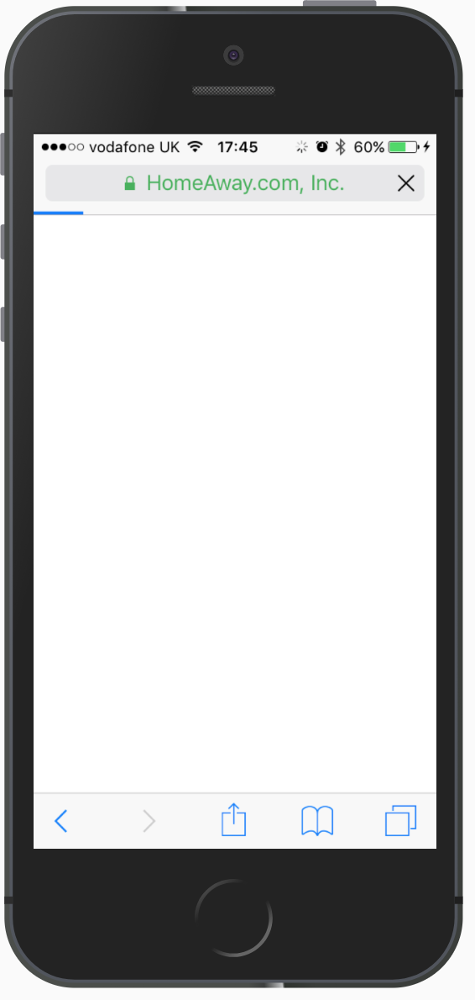
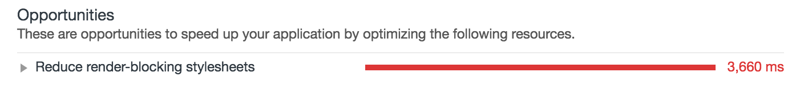

# What's <span style="white-space: nowrap">render-blocking</span>?

Csaba Palfi ([@csabapalfi](https://twitter.com/csabapalfi))

---



Note:

> A problem of a network request preventing the browser from rendering the page (progressively).

---
# 🎓
# How did we learn about this?

---

# PageSpeed Insights


---

# in Lighthouse, too



---
# 🤔 let's take a step back
---

# browsers: 🌐 🔜 🎨 
<h3 class="fragment fade-up">1. *get HTML* → DOM</h3>
<h3 class="fragment fade-up">2. link to CSS → *get CSS* → CSSOM</h3>
<h3 class="fragment fade-up">3. DOM + CSSOM → render tree</h3>
<h3 class="fragment fade-up">4. render tree → layout/reflow</h3>
<h3 class="fragment fade-up">5. layout/reflow → paint</h3>


Note:

>   render tree: computed styles

>   layout/reflow: box-model, exact position/size in viewport

>   ignoring JS/fonts etc in this talk

---
# ⚠️ critical path

### resources → pixels on the screen
### goal: getting to paint ASAP

---

# 🚫 render-blocking CSS

### `<link>` to CSS → <span class="fragment highlight-red">*get CSS*</span> → CSSOM

<h1 class="fragment fade-up">😱</h1>

---
# what to measure?

---
# 🤷 is it happening?

### `first-paint` ([Paint Timing API](https://w3c.github.io/paint-timing/))
### [Start Render](https://sites.google.com/a/webpagetest.org/docs/using-webpagetest/metrics) - on webpagetest.org

---
# 🔍 let's find a page
### that has the problem

--- 


Note:
  
> cleaned up a bit: no JS

>   https://csabapalfi.github.io/whats-render-blocking/example/original/

>  Not picking on anyone, just an example it's an old landing page it seems for non-logged in users

---
# 📊 baseline
### `first-paint`
### <span class="fragment fade-up">💻 </span> ~0.5s
<h3 class="fragment fade-up">📱 ~3s</h3>
<h3 class="fragment fade-up">🐌 ~10s</h3>

Note:

> https://www.webpagetest.org/video/compare.php?tests=171105_4T_95d9effc4201862941b63137b87197c9

---
<!-- .slide: data-background="img/mobile-throw.gif" -->

---
# 🔧 how to fix this?

---
# ✅ Inline critical CSS

embed styles for rendering above-the fold content

```html
<style>
    /* yes, here */
</style>
```

---

# 🤦 Wait a second

```html
<link rel="stylesheet" href="..." >
```

---

# ⬇️ Async loading CSS

for below the fold

```html
<link 
  rel="preload" href="..." as="style" 
  onload="this.rel='stylesheet'"
>
```
---

# 🥁 Results

Note:

> https://csabapalfi.github.io/whats-render-blocking/example/fixed

> Had to extract an icon font, too

---

# 📉 baseline vs fixed

### `first-paint`
### 💻 <0.5s → <0.5s
<h3 class="fragment fade-up">📱 ~3s → ~1s</h3>
<h3 class="fragment fade-up">🐌 ~10s -> ~2s</h3>

---

<!-- .slide: data-background-video="video/3g.mp4" data-background-size="contain" -->

Note:

> 3G Comparison Video: https://www.webpagetest.org/video/compare.php?tests=171104_MT_fb281ceeb63da8ff610aafc56a7a4f6e,171104_45_8eca18bc58287f738c1bc3273c95120d

---

<!-- .slide: data-background-video="video/slow-3g.mp4" data-background-size="contain" -->

Note:

> Slow 3G Comparison Video: https://www.webpagetest.org/video/compare.php?tests=171103_TW_a2ef99f5d74d5420325086146a91c6c6,171103_WH_22ad6263a3ef4a0c94add8cb470c4cc0

---
# 💢 Gotchas

---
# 🏆 are we done?

### is this even your bottleneck?
### how many slow 3G users? - tricky
### it's sooo not just about first-paint
### [#LNM 14/11](https://www.meetup.com/LNM-London-Node-JS-Meetup/events/244280416/)

---
# 👇 below the fold

### where is the fold?
### what if the user scrolls early?

---
# ⚒️ critical CSS

### how to extract (but e.g. styletron)
### keeping it small
### testing with critical CSS only
### `@import`, relative `url(...)`s

---
# 🚚 async loaded CSS

### `rel=preload` browser support
### `<noscript>`

---
# Should've been a blog post?

### [I have a blog post, too!](https://csabapalfi.github.io/eliminate-render-blocking/) - bit out of date

### also [Critical Rendering Path](https://developers.google.com/web/fundamentals/performance/critical-rendering-path/) by Google

---

# Thanks! Questions?

[@csabapalfi](https://twitter.com/csabapalfi)
