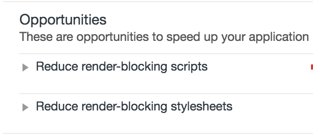
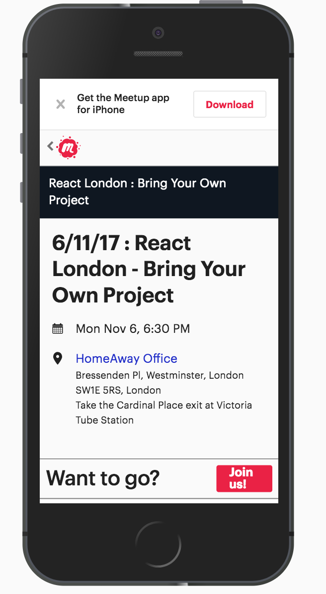

# What's render-blocking?

...and how we avoid it

[@csabapalfi](https://twitter.com/csabapalfi)

<!-- landing pages: fast + targeted -->

---
# 🎓
# How did we learn about all this?

---

# PageSpeed Insights

<!-- back in the day, score 0-100, suggestions -->

---


\+ compression, caching...

<!-- add a plugin, set a flag, done -->

---
# Then we saw this...


---
# in Lighthouse, too

<!-- TODO: better image -->


---
# 🤔 let's take a step back
---

# 🌐 browsers
<h3 class="fragment fade-up">1. *get HTML* → DOM</h3>
<h3 class="fragment fade-up">2. `<link>` to CSS → *get CSS* → CSSOM</h3>
<h3 class="fragment fade-up">3. DOM + CSSOM → render tree</h3>
<h3 class="fragment fade-up">4. render tree → layout/reflow</h3>
<h3 class="fragment fade-up">5. layout/reflow → paint</h3>

<!-- render tree: computed styles -->
<!-- layout/reflow: box-model, exact position/size in viewport -->
<!-- ignoring JS/fonts etc in this talk -->

---
# ⚠️ critical path

### these steps 1-5
### goal: getting to paint ASAP

---

# 🚫 render blocking CSS

### `<link>` to CSS → <span class="fragment highlight-red">*get CSS*</span> → CSSOM

<h1 class="fragment fade-up">😱</h1>

---
# how to measure this?

---
# 🎨 `first-paint`

### [Paint Timing API](https://w3c.github.io/paint-timing/) - experimental
### [Start Render](https://sites.google.com/a/webpagetest.org/docs/using-webpagetest/metrics) - on webpagetest.org

---

# 🔍 let's find a page

--- 



---

# 📊 baseline (TODO)

### `first-paint` avg (min-max): 
### <span class="fragment fade-up">🖥️ </span> 0.38 (0.31-0.64)
<h3 class="fragment fade-up">📱 2.77 (2.75-2.83)</h3>
<h3 class="fragment fade-up">🐌 10</h3>

---
<!-- .slide: data-background="img/mobile-throw.gif" -->

---
# 🔧 how to fix this?

---
# ✅ Inline critical CSS

embed styles for rendering above-the fold content

```html
<style>
    /* yes, here */
</style>
```

---

# 🤦 Wait a second

```html
<link rel="stylesheet" href="..." >
```

---

# ⬇️ Async loading CSS

below the fold can wait

```html
<link 
  rel="preload" href="..." as="style" 
  onload="this.rel='stylesheet'"
>
```

---
# 📊 fixed (TODO)

### `first-paint` change% - avg (min-max): 
### 0.38 (0.31-0.64)
### 📱 2.77 (2.75-2.83)</h3>
<h3 class="fragment fade-up">🐌 10</h3>

---
# 💢 Gotchas

---
# 🏆 Is this the first thing?

### it's not just about paint/rendering
### server side rendering assumed
### testing

---
# 👇 below the fold

### where is the fold?
### what if the user scrolls early?

---
# ⚒️ inlining critical CSS

### how to extract
### @import
### relative `url(...)`s
### keeping it small

---
# 🚚 async loading CSS

### `rel=preload` browser support  Chrome/Safari/(FF58?)
### `<noscript>`

---
> # Should've been a blog post?

## [It is!](https://csabapalfi.github.io/eliminate-render-blocking/)

---

# Thanks! Questions?
